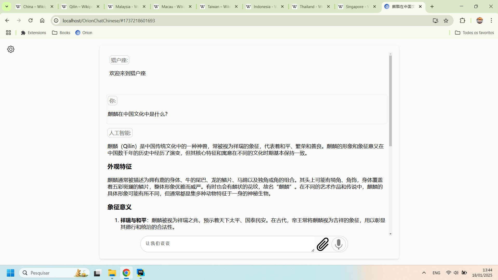

該存儲庫致力於將 [OrionChat](https://github.com/EliasPereirah/OrionChat) 翻譯成中文。翻譯中可能會有錯誤。非常歡迎提出改進建議。

# 猎户座 (Lièhùzuò)

猎户座是一个基于网络的聊天界面，简化了与多个 AI 模型提供商的交互。

它提供了一个统一的平台，用于聊天和探索多个大型语言模型 (LLMs)，包括：

- 🛠️ Ollama – 一个用于本地运行 LLMs 的开源工具 🏡
- 🤖 OpenAI (GPT 模型)
- 🎯 Cohere (Command-r 模型)
- 🌌 Google (Gemini 模型)
- 🟡 Anthropic (Claude 模型)
- 🚀 Groq Inc. – 针对快速推理进行了优化 (开源模型) ⚡️
- ⚡️ Cerebras – 也针对快速推理进行了优化 🚀
- 🟣 SambaNova - 快速推理并支持 Meta-Llama-3.1-405B-Instruct 🦙🦙🦙.🦙



使用猎户座，您可以通过直观、用户友好的界面轻松导航和评估不同 AI 模型的优势和局限性。

## 主要特点

- 🖥️ 浏览器 - 无需下载任何东西 ⚡️
- ✅ 代码执行 (使用 Google Gemini 执行代码)
- 🗣️ TTS - 使用 ElevenLabs 实现逼真的文本转语音
- 🎙️ STT - 使用 Groq/Whisper 实现语音转文本 ️
- 🔄 与多个 AI 模型无缝集成
- ✨ 简洁且响应迅速的网络界面 🌐
- 🌈 代码片段语法高亮 🖌️
- ⬇️ 一键下载 AI 生成的代码输出
- 🎛️ 可定制的系统提示来定制响应 🛠️
- 🌐 用于快速轻松地执行语言翻译任务的特殊命令
- 📁 将各种文档（文本、PDF、图像、视频）上传到 Google Gemini 进行分析和处理
- 🧠 优秀的提示 150+ 个优秀提示，其中大部分来自 [Awesome ChatGPT Prompts](https://github.com/f/awesome-chatgpt-prompts)
  ，可一键选择。

## API 密钥管理

您的 API 密钥使用 `localStorage` 进行本地存储，请求直接发送到官方提供商的 API (OpenAI, Anthropic, Google, Groq, Cerebras)
，无需通过任何外部代理路由。

### 免费 API 密钥

一些公司提供免费的 API 访问。在开始之前，请查看他们的条款和条件。

- **Google Gemini:** [获取您的密钥](https://aistudio.google.com/app/apikey)
- **Cerebras:** [注册 API 密钥](https://cloud.cerebras.ai/platform/)
- **Cohere:** [获取您的密钥](https://dashboard.cohere.com/api-keys)
- **Groq:** [申请密钥](https://console.groq.com/keys)
- **SambaNova:** [SambaNova 密钥](https://cloud.sambanova.ai/apis)
- **Together AI:** 仅适用于
  meta-llama/Llama-3.3-70B-Instruct-Turbo-Free [TogheterAI 密钥](https://api.together.ai/settings/api-keys)

### 付费 API 密钥
- **OpenAI:** [获取您的密钥](https://platform.openai.com/api-keys)
- **Anthropic:** [注册 API 密钥](https://console.anthropic.com/settings/keys)

# 特殊命令

使用特殊命令可以快速轻松地执行操作。

### 翻译

**翻译:** 使用特殊命令轻松翻译文本。

- 要将 "大家好!" 翻译成西班牙语，请使用：`translate:spanish 大家好!` 或其简短形式 `t:spanish 大家好!`。
- AI 将自动检测源语言，仅需指定目标语言。


### 键盘快捷键

按 `Ctrl + Q` 关闭当前聊天并开始新的聊天。


### 在用户的浏览器中执行 JavaScript 代码。

请谨慎执行此功能，并在接受执行之前始终检查代码。

- 示例：`javascript: 'Strawberry' 中有多少个 R？` 或 `js: 'Strawberry' 中有多少个 R？`
- 这将允许 AI 生成将在您的浏览器中运行的 Javascript 代码。

### 在远程环境中执行 Python 代码

- 使用 Google Gemini 时，您可以要求它直接在 Google 自己的远程环境中执行代码。目前仅执行 Python 代码。代码和输出将被返回。
- 命令示例：`py: 运行一个 Python 代码，以相反的顺序写 "tseb eht sI noirO"`
- 另一个示例：`py: 美国人口为 342,524,968，其中每年有 480,000 人死于烟草使用。这是多少百分比？`

# 如何运行

要运行猎户座，首先下载此存储库。

您可以通过在终端中运行以下命令来下载它：

```bash
git clone https://github.com/EliasPereirah/OrionChatChinese.git
```

或通过单击绿色按钮 "Code"
，然后单击 [Download ZIP](https://github.com/EliasPereirah/OrionChatChinese/archive/refs/heads/master.zip) 从存储库下载 zip 文件。

下载后，如果您没有服务器，只需打开文件夹并单击 index.html。

如果有，只需访问保存项目的目录。就这么简单。
